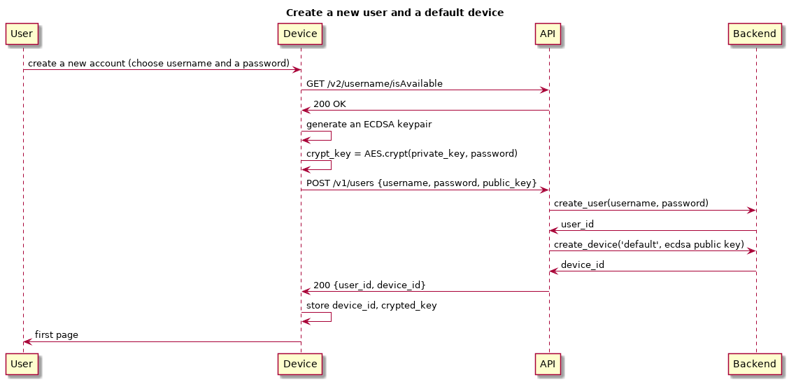
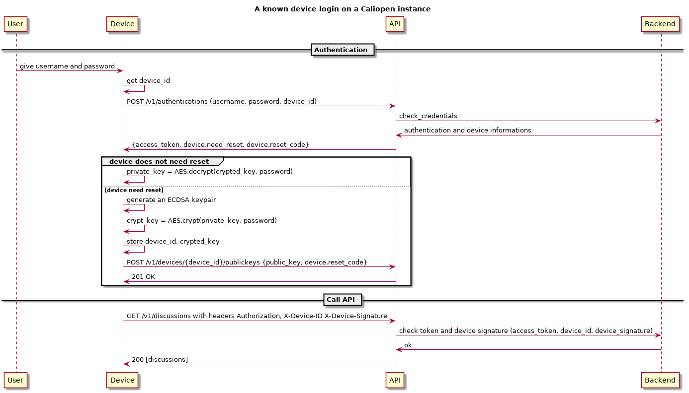
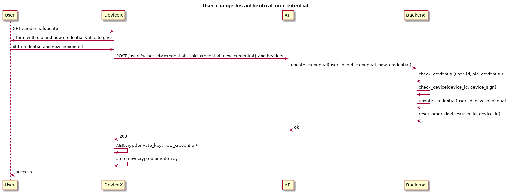

# Device Identification

## Abstract

User devices connecting to Caliopen have to be identified strictly as possible.
So cryptopgraphic mechanism to sign device request are used. This document describe
how this signature is managed.

## TL;DR;

A private ECDSA key is crypted with the user password using AES algorith and stored in device.
This private key permit to sign all request made by a device to be validated by the backend.

## Create a device on user registration

When a user register to a Caliopen instance, we declare the used device as it's main one.
The device will generate an ECDSA key pair and send the public one to Caliopen upon registration.

The device crypt using AES the private key with the password choosen and keep it in it's local storage.

A device_id is assigned and must also be stored on the device.



## How a device is identified

When connecting to caliopen, the device decrypt the private key and must sign every API request using
this private key. At this time it's the access_token value that must be used for signing.

Device must add some HTTP headers to implement this signature mechanism:

```
X-Caliopen-Device-ID: aaaa-bbbb-cccc-dddd-eeee
X-Caliopen-Device-Signature: BASE64(privkey.sign(access_token))
Authentication: bearer;user_id:access_token
```



### Backend validation

After validating the access_token the API will validate the device signature using:

```
Pu = current public key for device
Pu.verify_signature(access_token)
```

## Manage password change or reset on all devices.

The crypted private key can't be recover on a device when the user had change or reset his password on
another device. Upon authentication with such device, Caliopen reply that this device must be reset and
generate a new ECDSA keypair.


